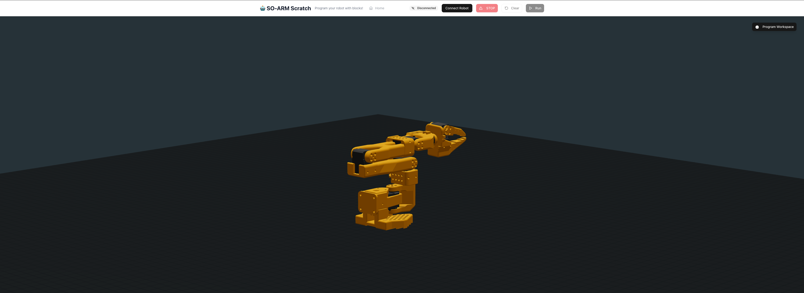

# SO-ARM Scratch Programming Interface

A kid-friendly visual programming interface for the SO-ARM101 robot arm using block-based programming similar to Scratch. Inspired by [Bambot](https://bambot.org).

## Features

- 🤖 **3D Robot Visualization**: See your robot in a 3D environment
- 🧩 **Block-Based Programming**: Drag and drop blocks to program your robot
- 🔗 **Direct Robot Connection**: Connect to your physical SO-ARM101 via USB/Serial
- 👶 **Kid-Friendly Interface**: Designed specifically for children to learn programming
- 💾 **Save/Load Programs**: Export and import your programs as JSON files
- ⚡ **Real-time Control**: See your program execute on both the virtual and physical robot

]

## Getting Started

### Prerequisites

- Node.js 18+ or Bun
- A modern web browser (Chrome/Edge recommended for Web Serial API support)
- SO-ARM101 robot arm (optional - simulation works without hardware)

### Installation

1. Install dependencies:
```bash
bun install
```

2. Start the development server:
```bash
bun run dev
```

3. Open your browser and navigate to `http://localhost:3000`

## How to Use

### 1. Connect Your Robot (Optional)
- Click the "Connect Robot" button in the top-right corner
- Select your SO-ARM101 device from the list
- The status indicator will turn green when connected

### 2. Program Your Robot
- **Move Joint**: Control individual joints of the robot arm
- **Rotate Base**: Rotate the robot's base
- **Wait**: Add delays between movements
- **Repeat**: Loop actions multiple times

### 3. Build Your Program
1. Click on blocks in the left palette to add them to your program
2. Drag blocks to reorder them
3. Click on a block to edit its parameters in the right panel
4. Use the X button to remove blocks

### 4. Run Your Program
- Click "Run Program" to execute your blocks
- Watch the 3D simulation and physical robot move together
- Use "STOP" for emergency stops

### 5. Save and Share
- Export your programs as JSON files
- Import previously saved programs
- Share your creations with friends!
